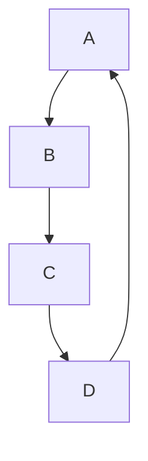
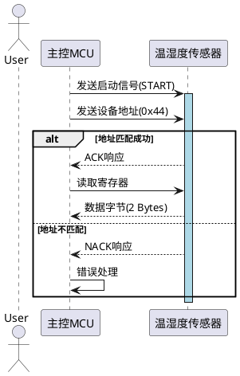

## mermaid示例



## plantuml示例



## javascript示例

```javascript
const md = markdownIt({
  highlight: function (str, lang) {
    return `<code-block language="${lang}">${str}</code-block>`;
    // 如果指定了语言
    if (lang && hljs.getLanguage(lang)) {
      try {
        return '<pre class="hljs"><code>' +
               hljs.highlight(str, { language: lang, ignoreIllegals: true }).value +
               '</code></pre>';
      } catch (__) {}
    }
    // 未指定语言时自动检测
    return '<pre class="hljs"><code>' +
           hljs.highlightAuto(str).value +
           '</code></pre>';
  },
  html: true,          // 允许HTML标签[2](@ref)
  linkify: true,       // 自动转换URL为链接[4](@ref)
  typographer: true    // 支持印刷字符替换[3](@ref)
});
```

