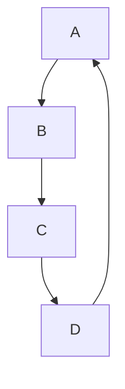
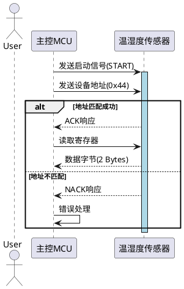

## mermaid示例

```mermaid
  graph TD;
    A-->B;
    B-->C;
    C-->D;
    D-->A;
```

## plantuml示例

```plantuml
@startuml
actor User
participant "主控MCU" as MCU
participant "温湿度传感器" as Sensor

MCU -> Sensor: 发送启动信号(START)
activate Sensor #LightBlue
MCU -> Sensor: 发送设备地址(0x44)
alt 地址匹配成功
    Sensor --> MCU: ACK响应
    MCU -> Sensor: 读取寄存器
    Sensor --> MCU: 数据字节(2 Bytes)
else 地址不匹配
    Sensor --> MCU: NACK响应
    MCU -> MCU: 错误处理
end
deactivate Sensor
@enduml
```
