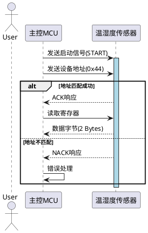

## plantuml示例



```javascript
import mermaid from 'mermaid';

class MermaidChart extends HTMLElement {
  constructor() {
    super();
    this.attachShadow({ mode: 'open' });
    this.shadowRoot.innerHTML = `
      <style>
        :host { display: block; }
        .container { padding: 12px; }
      </style>
      <div class="container"></div>
    `;
    this.container = this.shadowRoot.querySelector('.container');
  }

  // 监听属性变化
  static get observedAttributes() {
    return ['code', 'theme'];
  }

  attributeChangedCallback(name, oldVal, newVal) {
    if (oldVal !== newVal) {
      this.render();
    }
  }

  // 渲染逻辑
  async render() {
    const code = this.getAttribute('code') || '';
    const theme = this.getAttribute('theme') || 'default';
    
    // 初始化 Mermaid
    await mermaid.initialize({ theme });
    const { svg } = await mermaid.render('mermaid-chart', code);
    this.container.innerHTML = svg;
  }
}

// 注册自定义元素
customElements.define('mermaid-chart', MermaidChart);
```